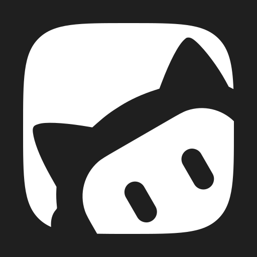
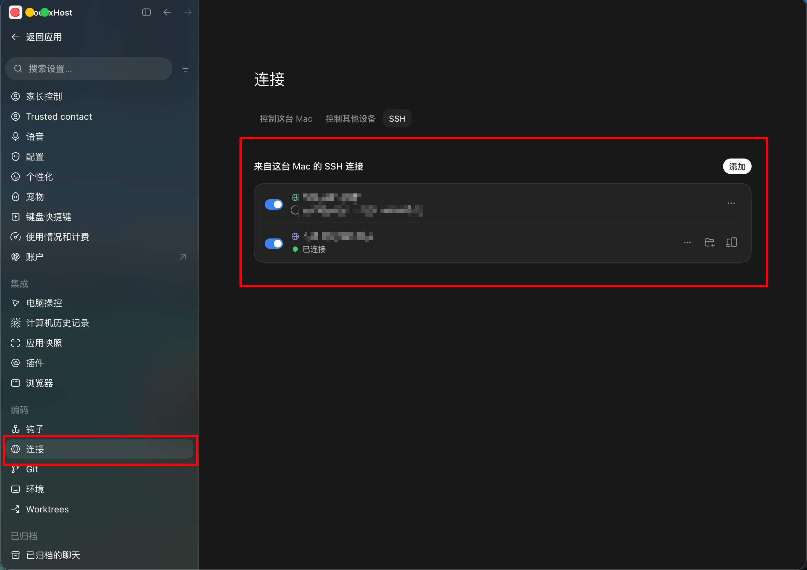

<div align="center">

# CodexHost

**Run Pi and other Harnesses inside Codex Desktop**

We believe **Codex Desktop** offers the best desktop development experience today

But **Codex** is not the only capable **Agent Harness**. There are also **Claude Code** and **Pi**

**CodexHost** lets you use other **Harnesses** natively inside **Codex Desktop**, and lets them work together

⭐ If this project helps you, please give it a Star! ⭐

<p>
  <a href="https://pi.dev/"></a>
  <a href="https://openai.com/codex/"></a>
  <a href="https://code.claude.com/docs/en/quickstart"></a>
  <a href="https://opencode.ai/docs/"></a>
  <a href="https://grok.com/"></a>
  <a href="https://github.com/can1357/oh-my-pi"></a><br />
  <a href="https://github.com/deepseek-ai/deepseek-harness"></a>
  <a href="https://antigravity.google/product/antigravity-cli"></a>
  <a href="https://kiro.dev/docs/cli/"></a>
  <a href="https://www.codebuddy.cn/home/"></a>
  <a href="https://www.workbuddy.ai/docs/workbuddy/Quickstart"></a>
  <a href="https://cursor.com/docs/cli/overview"></a>
  <a href="https://hermes-agent.nousresearch.com/docs"></a>
  <a href="https://qoder.com/cli"></a>
</p>
<br />

<p align="center"><a href="https://github.com/BytePioneer-AI/codex-host/releases"><strong>Download</strong></a> · <a href="#cross-agent-collaboration">Cross-Agent collaboration</a> · <a href="#remote-harness">Remote</a> · <a href="#join-the-community">Community</a> · <a href="docs/project/README.zh-CN.md">简体中文</a> · <a href="docs/project/README.ko.md">한국어</a></p>

<br />

</div>

## Interface Preview

No app switching required: **Pi, Claude Code, Grok Build, and more than ten other Harnesses** all run directly in the same Codex Desktop window.

https://github.com/user-attachments/assets/c48192d7-23ff-4f6e-b61a-6345a655bb76

### Interface

<div align="center">
  
</div>

## Quick Start

**Option 1: npm** (macOS / Windows / Linux)

```bash
npm install -g @codexhost/cli
codexhost
```

**Option 2: Installer** (macOS / Windows)

Download the installer for your platform from [Releases](https://github.com/BytePioneer-AI/codex-host/releases).

> Linux supports x64 / ARM64. See the [Linux guide](docs/platforms/linux/linux.md).

<details>
<summary>Installation troubleshooting</summary>

**macOS: "the app cannot be verified" on first launch**

```bash
xattr -dr com.apple.quarantine /Applications/codexhost.app
```

**Windows: using a portable (extracted) Codex Desktop**

1. Set `CODEXHOST_INSTALL_ROOT` to the extracted Codex Desktop directory:

   ```powershell
   [Environment]::SetEnvironmentVariable("CODEXHOST_INSTALL_ROOT", "D:\CodexPortable", "User")
   ```

2. Fully quit Codex Desktop, open a new terminal, and run `codexhost`.

</details>

### Interaction Examples

<table>
  <tr>
    <td colspan="2" valign="top">
      <p><strong>Full workspace</strong></p>
      <div align="center">
        
      </div>
    </td>
  </tr>
  <tr>
    <td colspan="2" valign="top">
      <p><strong>Remaining usage</strong></p>
      
    </td>
  </tr>
  <tr>
    <td colspan="2" valign="top">
      <p><strong>Mermaid diagram rendering</strong></p>
      <div align="center">
        
      </div>
    </td>
  </tr>
</table>

## Feature Status

Every Harness can use Codex Desktop's native Edit Diff, Fork, message editing, and slash commands.

<details>
<summary>Full feature matrix</summary>

| Capability | <a href="https://pi.dev/"></a> | <a href="https://github.com/can1357/oh-my-pi"></a> | <a href="https://code.claude.com/docs/en/quickstart"></a> | <a href="https://opencode.ai/docs/"></a> | <a href="https://grok.com/"></a> | <a href="https://github.com/deepseek-ai/deepseek-harness"></a> | <a href="https://antigravity.google/product/antigravity-cli"></a> | <a href="https://www.codebuddy.cn/home/"></a> | <a href="https://www.workbuddy.ai/docs/workbuddy/Quickstart"></a> | <a href="https://cursor.com/docs/cli/overview"></a> | <a href="https://hermes-agent.nousresearch.com/docs"></a> | <a href="https://qoder.com/cli"></a> |
| :--- | :---: | :---: | :---: | :---: | :---: | :---: | :---: | :---: | :---: | :---: | :---: | :---: |
| Streaming responses | ✅ | ✅ | ✅ | ✅ | ✅ | ✅ | ✅ | ✅ | ✅ | ✅ | ✅ | ✅ |
| Tool status | ✅ | ✅ | ✅ | ✅ | ✅ | ✅ | ✅ | ✅ | ✅ | ✅ | ✅ | ✅ |
| Edit Diff | ✅ | ✅ | ✅ | ✅ | ✅ | ✅ | ✅ | ✅ | ✅ | ✅ | ✅ | ✅ |
| Questions / cancellation | ✅ | ✅ | ✅ | ✅ | ✅ | ✅ | ✅ | ✅ | ✅ | ✅ | ✅ | ✅ |
| Model / Thinking selection | ✅ | ✅ | ✅ | ✅ | ✅ | ✅ | ✅ | ✅ | ✅ | ✅ | ✅ | ✅ |
| Tool approvals | ✅ | ✅ | ✅ | ✅ | ✅ | ✅ | — | ✅ | ✅ | ✅ | ✅ | ✅ |
| Permission modes | — | ✅ | ✅ | ✅ | ✅ | ✅ | ✅ | ✅ | ✅ | ✅ | ✅ | ✅ |
| Cross-Agent task collaboration | ✅ | ✅ | ✅ | ✅ | ✅ | ✅ | ✅ | ✅ | — | ✅ | ✅ | ✅ |
| Usage | ✅ | ✅ | ✅ | ✅ | ✅ | ✅ | ✅ | ✅ | ✅ | — | ✅ | ✅ |
| Fork | ✅ | ✅ | ✅ | ✅ | ✅ | ✅ | ✅ | ✅ | ✅ | ✅ | ✅ | ✅ |
| Context compaction | ✅ | ✅ | ✅ | ✅ | ✅ | ✅ | — | ✅ | ✅ | — | ✅ | ✅ |
| Slash commands | ✅ | ✅ | ✅ | ✅ | ✅ | ✅ | ✅ | ✅ | ✅ | ✅ | ✅ | ✅ |
| Edit previous message | ✅ | ✅ | ✅ | ✅ | ✅ | ✅ | ✅ | ✅ | ✅ | ✅ | ✅ | ✅ |

</details>

## Cross-Agent collaboration

You can ask the current Agent to hand an independent task to another Harness. For example:

> Ask `claude-code` to review this change independently and point out compatibility risks.
>
> Ask `pi` to investigate why this test fails intermittently.
>
> Ask `omp` to implement this feature while I continue working on the documentation.
>
> Ask `opencode` to verify this fix in an independent Thread and run the related tests.

CodexHost creates a separate Native Session for the target Harness. The delegated session appears in the Codex Desktop conversation list, where you can open it, check progress, or continue the conversation.

<details>
<summary><h3 id="remote-harness">Remote Harness</h3></summary>

Use Harnesses on a controlled machine from your local Codex Desktop. Tasks run on the controlled machine while the UI stays local. Both ends need the same codexhost version.

| Controlled machine | Connection method |
| --- | --- |
| macOS / Linux | [SSH remote](#ssh-remote) |
| Windows | [Remote Control remote](#remote-control-remote-experimental) (experimental) |

#### SSH remote

Prerequisite: the controlled machine is added in Codex Desktop under **Settings → Connections → SSH**. The client can be macOS, Linux, or Windows.

<div align="center">
  
</div>

1. Install and start on the controlled machine:

   ```bash
   npm install -g @codexhost/cli
   codexhost remote install
   codexhost remote start
   codexhost remote status
   ```

2. Launch Codex Desktop through codexhost locally and open the SSH workspace.
3. Pick the target Harness in the composer's Agent / Model selector.

[SSH setup, diagnostics, and uninstall →](docs/platforms/remote/remote-ssh-host.md)

#### Remote Control remote (experimental)

Reuses the pairing and authentication of Codex Desktop's official Remote Control to use Harnesses on Windows from another computer.

Prerequisite: official Remote Control can already run Codex tasks. No public service or port is added, and Harness credentials stay on Windows.

[Remote Control setup, transport boundary, and diagnostics →](docs/platforms/remote/remote-control-host.md)

</details>

<details>
<summary><h3>How it works</h3></summary>

Most multi-agent clients build their own chat UI and connect different Harnesses through a common protocol.

CodexHost takes a different approach:

- **Desktop side:** enhances the official Codex Desktop through CDP / Electron Inspector, without rebuilding the chat UI or modifying the official installer
- **Protocol side:** connects to the official app-server through a CLI Shim; native Codex requests are forwarded unchanged and unaffected
- **Harness side:** prefers each Harness's native interface (Pi via RPC, Claude Code via the Agent SDK) and falls back to [ACP](https://agentclientprotocol.com/) when there is none; streaming output, tool status, diffs, approvals, and questions are all projected into Codex Desktop's native UI
- **Orchestration side:** delegated tasks run as independent native sessions in the target Harness, and the initiator can wait for the result or let it run in the background

</details>

## Join the community

<table align="center">
  <tr>
    <td>
      <strong>Join the community</strong><br />
      <sub>Developers interested in CodexHost usage and features can scan the QR code to join the WeChat group.</sub>
      <ul>
        <li><sub>Ask installation questions in the group</sub></li>
        <li><sub>Feature suggestions and feedback</sub></li>
        <li><sub>Development discussion</sub></li>
        <li><sub>For bugs, please file an <strong>issue</strong></sub></li>
      </ul>
      <sub><strong>Contributions are welcome.</strong></sub>
    </td>
    <td align="center">
      
    </td>
  </tr>
</table>

## Development

Read the [contributing guide](CONTRIBUTING.md) before opening an Issue or PR. PR title labels, short CI results, and pre-release checks are described in [repository maintenance automation](docs/operations/repository-maintenance.md).

Requirements: official Codex Desktop, Node.js 22.19+ or 24, and Rust.

```bash
git clone https://github.com/BytePioneer-AI/codex-host
cd codex-host
npm ci
npm start
```

### Runtime architecture

Using Pi as the example. Left to right is one request's call chain: Desktop → shared layer → Pi plugin → native process.

<div align="center">
  
</div>

### Adding a Harness

The main work is implementing the plugin Manifest, factory, Adapter, Session, and the native communication and conversion logic. The Renderer still has some static wiring, so full Desktop integration needs additional work.
When adding a Harness, you can have a coding Agent use the in-repo [codexhost-add-harness Skill](.agents/skills/codexhost-add-harness/SKILL.md). It covers plugin structure, the public Adapter interface, capability implementation, and test requirements.

## Acknowledgements

- Thanks to the [LINUX DO](https://linux.do/) community for its continued support.
- Thanks to the [Paseo](https://github.com/getpaseo/paseo) project for inspiring and informing the multi-Harness integration approach and architecture.

## Star History

<a href="https://www.star-history.com/?repos=bytepioneer-ai%2Fcodex-host&type=date&legend=top-left">
  <picture>
    <source media="(prefers-color-scheme: dark)" srcset="https://api.star-history.com/chart?repos=bytepioneer-ai/codex-host&type=date&theme=dark&legend=top-left" />
    <source media="(prefers-color-scheme: light)" srcset="https://api.star-history.com/chart?repos=bytepioneer-ai/codex-host&type=date&legend=top-left" />
    
  </picture>
</a>
